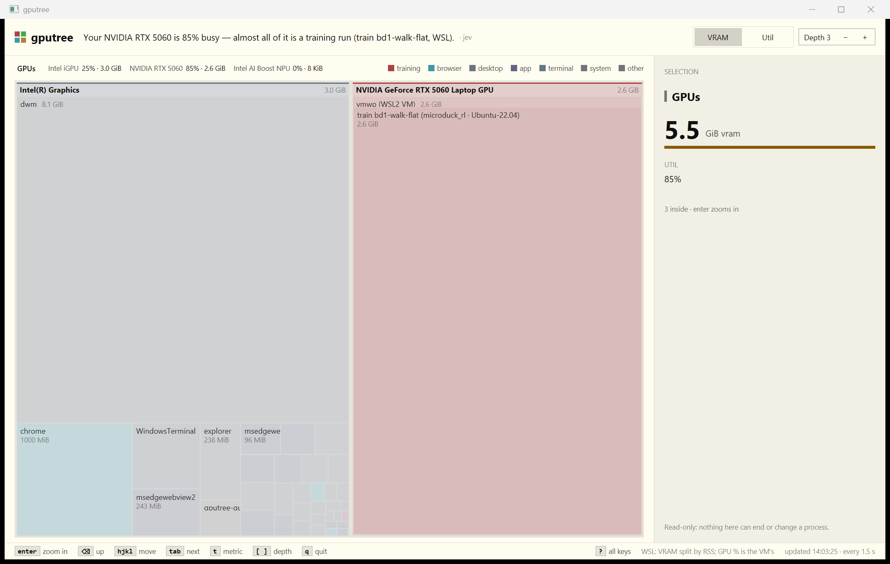
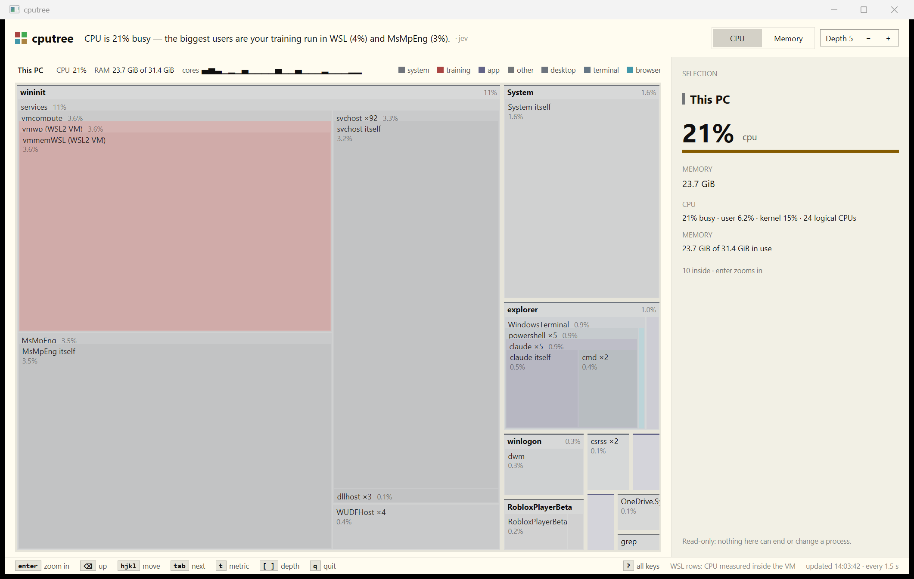

# gputree

What is using your GPUs, as a tree — adapter, then process, then engine, and
for WSL2 the Linux processes inside the VM — with one plain-English sentence on
top that says what is going on.

```
Your NVIDIA RTX 5060 is 55% busy — almost all of it is a training run (train bd1-walk-flat, WSL).  · jev
gputree  3 adapters · ranked by vram · 12:41:42

NVIDIA GeForce RTX 5060 Laptop GPU  74°C · 42 W
 mem  █████▏         3.2 GiB        of 7.7 GiB
 util ██████▋                  55%  3d 55% · copy 1%
 tags [training] 3.2 GiB 55%  [system] 4 MiB 0%
├──── ███████████▋   3.2 GiB   55%  vmwp (WSL2 VM)                                     [training]  pid 36088
│  ├─ ██████▋                  55%  3d
│  ├─ ▏                       1.2%  copy
│  ├─                2.8 GiB        train bd1-walk-flat  (microduck_rl · Ubuntu-22.04) [training]  pid 4934
│  └─                 80 MiB        + spilled to shared memory
├──── ············     4 MiB    0%  System                                             [system]    pid 4
└────                264 KiB        + 7 more processes (--all to list)

Intel(R) Graphics
 mem  █▊··········   2.6 GiB        of 17.9 GiB shared
 util ▌···········              4%  3d 4%
 tags [desktop] 6.3 GiB 0%  [browser] 870 MiB 0%  [app] 599 MiB 0%  [terminal] 427 MiB 4%
├──── ████████████   5.7 GiB    0%  dwm                                                [desktop]   pid 2572
├──── ███▊········   845 MiB    0%  chrome                                             [browser]   pid 14548
├──── █▉··········   406 MiB    4%  WindowsTerminal                                    [terminal]  pid 15644
│  └─ ▍···········            3.6%  3d
├──── █···········   231 MiB    0%  msedgewebview2                                     [app]       pid 13828
└────                474 MiB        + 31 more processes (--all to list)

WSL rows: Linux processes holding /dev/dxg (host RAM shown). They share one VM, so their GPU % is the VM's total.
```

In a terminal the bars are smooth eighth-blocks on a dim track and the tags are
coloured; piped, it prints plain text once.

The same repo builds **cputree**, the same idea for the CPU: the real process
tree with CPU and memory rolled up to parents, and the WSL2 VM opened up into
the Linux processes inside it (see [cputree](#cputree)).

It is the Windows counterpart of [disktree](https://github.com/tobi/disktree)'s
idea — a disk treemap — applied to GPU memory and time, and a native port of an
older PowerShell script (kept in [`legacy/`](legacy/)). The script took about
10 s; gputree draws its first frame in about 30 ms and is complete in 0.3 s
(0.5 s with the Jev headline).

Both tools also run natively on **Linux** with the same flags, screens and tags,
reading DRM fdinfo, NVML and `/proc` instead (see [Linux](#linux)).

**Read-only.** gputree samples performance counters, reads the registry, asks
NVML, and reads `/proc` inside WSL. It never kills, signals, suspends or
reprioritizes anything.

## Install

Download nothing; build it. You need Rust (1.85+) and, on the GNU toolchain,
`dlltool` from MSYS2's binutils on `PATH`:

```powershell
git clone https://github.com/gshklovs/gputree
cd gputree
cargo build --release
copy target\release\gputree.exe $HOME\bin\     # anywhere on PATH
copy target\release\cputree.exe $HOME\bin
```

With rustup's `x86_64-pc-windows-gnu` host (no Visual Studio needed), the
`windows-sys` import libraries are generated at build time by `dlltool`, which
calls an assembler. rustup's self-contained `dlltool` has none, so install
MSYS2's (`pacman -S mingw-w64-x86_64-binutils`) and put `C:\msys64\mingw64\bin`
on `PATH` for the build. The MSVC toolchain builds it as is.

Windows 10 1709 or newer (the GPU counters appeared then). NVIDIA stats need a
driver with `nvml.dll`; WSL rows need WSL2.

## Use

```sh
gputree                  # adapters -> processes -> engines, largest first
gputree --metric util    # rank by GPU time instead of memory
gputree --group          # adapter -> tag -> process
gputree --watch 2        # redraw every 2 s until Ctrl+C
gputree --all --depth 1  # every process with a GPU handle, no children
gputree | less           # piped: waits (at most ~2 s) and prints plain text once
```

| flag | does |
| --- | --- |
| `-m`, `--metric vram\|util` | rank by memory (default) or by utilisation |
| `-d`, `--depth 1-3` | levels under each process: 1 none, 2 WSL processes, 3 also engines and spill (default) |
| `-w`, `--watch N` | redraw the whole screen every N seconds until Ctrl+C |
| `-n`, `--top N` | processes shown per adapter (default 10) |
| `-g`, `--group` | insert a tag layer: adapter → tag → process |
| `-a`, `--all` | list every process with a GPU handle, idle ones too; lifts `--top` |
| `--no-wsl` | do not look inside WSL distros |
| `--no-ai` | do not call Jev; the headline stays the local one |
| `--width N` | lay out for N columns (also `GPUTREE_WIDTH`, `COLUMNS`) |
| `--no-color` | plain output (also `NO_COLOR`; automatic when piped) |
| `-h`, `--help` | the flags |

The PowerShell spellings (`-Metric util`, `-NoWsl`, `-Group`) still work.

### The screen

- **Headline:** one sentence about the busiest adapter and what dominates it.
  A dim `· jev` after it means Jev picked the wording (below).
- **Adapter:** name, NVIDIA temperature and power when the GPU is awake, then
  `mem` (dedicated VRAM, or shared memory for an integrated GPU), `util` (the
  busiest engine type summed across processes — the number Task Manager shows)
  with the per-engine split, and `tags`, the rollup per kind of workload.
- **Rows:** one grid for every depth. The tree gutter is the same width on
  every row — shallower branches are drawn out with `─` — so the bar, memory,
  utilisation, name, tag and pid columns line up from the adapter's processes
  down to their engines and the Linux processes in the VM. Process bars are
  relative to the adapter's memory in use (or to 100% with `--metric util`).
- **Nothing is wider than the terminal.** Names are clipped with `…`, a WSL
  command is first shortened to its script, its first arguments and its
  project (`train bd1-walk-flat  (microduck_rl · Ubuntu-22.04)`), then loses
  the distro, then the project, before it is clipped. The headline wraps.

### Progressive drawing

In a terminal gputree draws as soon as it can and redraws in place:

1. **~30 ms** — adapters, memory and processes; utilisation shows `…`.
2. **~300 ms** — a second counter sample 280 ms after the first fills in
   utilisation (it is a rate, so it needs two).
3. **as they land** — NVIDIA temperature and power (NVML on its own thread,
   `nvidia-smi` as the fallback), the Linux processes in WSL, and Jev. Each
   has a deadline; whatever is late is left out. NVML is only asked when the
   counters show the NVIDIA GPU in use, because asking wakes a sleeping laptop
   GPU and takes ~2 s.

If the output is taller than the window, the in-between frames are skipped and
the final one is drawn. In `--watch`, each frame's utilisation covers the whole
interval since the last one.

## cputree

```
CPU is 16% busy — mostly your training run in WSL (11%) and MsMpEng (1%).  · jev
cputree  24 logical CPUs · 31.4 GiB RAM · ranked by cpu · 13:10:43

 cpu              █▉··········   16%                  user 1% · kernel 14%
 cores            ▅▅▂▁▁▁▁▁▁▁▁▄▁▆▁▁▁▁▁▁▂▁▄▂
 mem              ████████····              21.1 GiB  of 31.4 GiB (67%)
 tags             [training] 11% 5.1 GiB  [system] 0.4% 1.7 GiB  [other] 0.4% 261 MiB  [app] 0.2% 2.5 G…

                                Σcpu   own      Σmem  process tree
├──────────────── █▍··········   11%    0%   6.6 GiB  wininit                     [system]    pid 1976
│  ├───────────── █▍··········   11%    0%   6.6 GiB  services                    [system]    pid 1148
│  │  ├────────── █▍··········   11%    0%   5.1 GiB  vmcompute                   [other]     pid 3252
│  │  │  └─────── █▍··········   11%    0%   5.1 GiB  vmwp (WSL2 VM)              [training]  pid 36088
│  │  │     └──── █▍··········   11%   11%   5.1 GiB  vmmemWSL (WSL2 VM)          [training]  pid 16148
│  │  │        ├─ ▌···········    4%    4%   2.7 GiB  train bd1-walk-flat         [training]  pid 103308
│  │  │        ├─ ············    0%    0%    90 MiB  server --logdir=logs/rsl_r… [training]  pid 6974
│  │  │        └─ ············    0%    0%    85 MiB  tensorboard --logdir bd1_w… [training]  pid 6949
│  │  ├────────── ············  0.2%  0.2%   337 MiB  MsMpEng                     [system]    pid 5692
│  │  ├────────── ············    0%    0%   930 MiB  svchost ×93                 [system]    93 procs
│  │  ├────────── ············    0%    0%    67 MiB  tailscaled                  [other]     pid 6280
│  │  ├────────── ············    0%    0%    15 MiB  nvcontainer                 [other]     pid 5500
│  │  ├────────── ············    0%    0%    14 MiB  ArmouryCrate.Service        [other]     pid 5156
│  │  ├────────── ············    0%    0%    12 MiB  SearchIndexer               [system]    pid 10780
│  │  ├────────── ············    0%    0%    12 MiB  NVDisplay.Container         [other]     pid 3852
│  │  └──────────                 0%          70 MiB  + 45 more processes (--all to list)
│  ├───────────── ············    0%    0%     7 MiB  lsass                       [system]    pid 1356
│  ├───────────── ············    0%    0%    44 KiB  LsaIso                      [system]    pid 1364
│  └───────────── ············    0%    0%    24 KiB  fontdrvhost                 [system]    pid 2200
├──────────────── ▏···········  0.9%    0%   4.4 GiB  explorer                    [desktop]   pid 14416
│  ├───────────── ▏···········  0.9%    0%   4.2 GiB  WindowsTerminal             [terminal]  pid 15644
```

disktree semantics, for processes: a row's **Σcpu** and **Σmem** are its whole
subtree (itself plus every descendant), like a directory's size; **own** is the
process alone. Rows are sorted by the subtree total, largest first, with
`+ N more` for the rest.

- **The real tree.** Parents come from the process list itself; a parent must
  have started before its child, so a reused pid never adopts strangers, and a
  process whose parent is gone is a root.
- **Merged siblings.** Same-name siblings become one row, `chrome ×42`, with
  summed numbers and all of their children underneath; `--all` lists them one
  by one.
- **WSL.** The VM's host process (`vmmemWSL`, else `vmmem`, else `vmwp`) opens
  into the busiest Linux processes of every running distro, measured inside
  the distro: `/proc/*/stat` read twice 300 ms apart, one `wsl.exe` call per
  distro, with the same base64-wrapped read-only script approach and the same
  shortened commands as gputree. Unlike GPU time, Linux CPU is attributable
  per process, so these rows have real numbers (as a share of all Windows
  logical CPUs, so they compare directly). The chain of parents down to the VM
  is always expanded, whatever `--depth` says.
- **Header.** Overall CPU with the user/kernel split, one character per logical
  CPU (wrapped to the width), RAM in use, and the tag rollup. CPU temperature
  is not shown: Windows only exposes it through WMI/ACPI, which is neither
  cheap nor reliable.
- **Same tags, same headline.** The gputree rules, plus: anything else under
  `C:\Windows\` and the well-known service hosts are `system`, and shells are
  `terminal`. The headline ("CPU is 38% busy — mostly your training run in WSL
  (22%) and Chrome (9%).") is built the same way, and Jev picks among the
  candidates and re-tags the busiest unknown processes the same way.
- **Same speed.** One `NtQuerySystemInformation` call returns every process
  with its parent, start time, CPU time and private working set: the first
  frame is drawn in ~15 ms with `…` for CPU, a second sample 300 ms later fills
  it in, and WSL (~0.45 s) and Jev land after.

| flag | does |
| --- | --- |
| `-m`, `--metric cpu\|mem` | rank by CPU (default) or memory |
| `-d`, `--depth N` | tree levels shown, 1-12 (default 4) |
| `-n`, `--top N` | children shown per node (default 8) |
| `-g`, `--group` | tag → process instead of the tree |
| `-a`, `--all` | no merging, no limits |
| `-w`, `--watch N`, `--no-wsl`, `--no-ai`, `--width N`, `--no-color` | as in gputree |

## Linux

`gputree` and `cputree` build and run natively on Linux with the same flags, the same screens and the same tags. Only the data layer is
different; the model, the renderer, the tags and the Jev call are shared code.
The GUI windows stay Windows-only and are not built on Linux.

### Install

```sh
# Rust (user-level) if you do not have it
curl --proto '=https' --tlsv1.2 -sSf https://sh.rustup.rs | sh -s -- -y --profile minimal
sudo apt install build-essential pkg-config      # a C linker; nothing else is needed

git clone https://github.com/gshklovs/gputree
cd gputree
cargo build --release
install -m 755 target/release/gputree target/release/cputree ~/.local/bin/
```

No system libraries are linked: NVML (`libnvidia-ml.so.1`) is loaded at run time
when it exists, and Jev goes through the system `curl`. `cputree` needs no
privileges. `gputree` sees GPU clients through `/proc/<pid>/fdinfo`, which the
kernel only shows for your own processes, so run `sudo gputree` to see every
user's (the same rule as nvtop and intel_gpu_top).

### Data sources on Linux

| what | where from |
| --- | --- |
| per-process GPU time and memory (amdgpu, i915, xe, nouveau, panfrost, ...) | DRM fdinfo: every fd pointing at `/dev/dri/card*` or `renderD*`, its `/proc/<pid>/fdinfo/<fd>` read twice ~280 ms apart. `drm-engine-*` busy ns (or xe's `drm-cycles-*` / `drm-total-cycles-*`) over the window, divided by `drm-engine-capacity-*`, is the utilisation; memory is `drm-resident-*`, else `drm-memory-*`, else `drm-total-*` (vram/local regions are dedicated, gtt/system shared). Clients are counted once per `drm-pdev` + `drm-client-id`, under the lowest pid holding them |
| engine names | mapped to the Windows ones so the tags' hints apply: gfx/render/rcs → `3d`, compute/ccs → `compute`, dec/video/vcs/jpeg → `videodecode`, enc → `videoencode`, copy/sdma/bcs → `copy` |
| NVIDIA (proprietary driver) per process | NVML: running compute and graphics processes (used memory), `nvmlDeviceGetProcessUtilization` samples since the last collection (SM → `compute` or `3d`, plus enc/dec); `nvidia-smi --query-compute-apps` if the library cannot be loaded. Only asked when an NVIDIA card is awake (`power/runtime_status`), since asking wakes a sleeping laptop dGPU |
| adapters | `/sys/class/drm/card*/device`: vendor, device, `uevent` (driver, PCI slot), amdgpu's `product_name` and `mem_info_vram_*` / `mem_info_gtt_*`; NVIDIA names and VRAM from NVML; other names from `pci.ids` ("GA106 [GeForce RTX 3060]" → "NVIDIA GeForce RTX 3060"). A GPU without its own VRAM is measured against half of RAM, like Windows' shared GPU memory |
| NVIDIA temperature and power | NVML, else `nvidia-smi` (as on Windows) |
| processes, tree, CPU | `/proc/<pid>/stat` (ppid, utime + stime, starttime, RSS, threads) sampled twice ~300 ms apart; the parent must have started before the child (pid-reuse guard); the same roll-up and same-name merging |
| machine and per-core CPU | `/proc/stat` (iowait counts as idle; irq, softirq and steal as kernel) |
| memory | `/proc/meminfo` (MemTotal − MemAvailable); per process VmRSS |
| names | argv[0]'s basename (comm is cut at 15 characters); for an interpreter, the script and its first arguments, like the WSL rows (`train bd1-walk-flat`); kernel threads by comm |
| CPU temperature | hwmon (`coretemp`, `k10temp`, `zenpower`, `cpu_thermal`), else the `x86_pkg_temp` / `cpu` thermal zone; shown after the user/kernel split when present |

Differences from the Windows screens, all small:

- **cputree** always expands the chain of parents down to the (up to three)
  processes using at least 1% of the machine, whatever `--depth` says. Linux
  trees run deep (`systemd → systemd --user → flock → timeout → python`), and
  without this the busiest process would hide under its wrappers. Kernel
  threads sit under `kthreadd`, tagged `system`.
- **Tags** also know the Linux names: Steam's `reaper`, anything under
  `steamapps/common` (path or command line), Proton and Wine → `game`; Xorg,
  Xwayland, gnome-shell, KWin, sway, Hyprland → `desktop`; PipeWire and
  PulseAudio → `audio`; QEMU → `vm`; gnome-terminal, Konsole, kitty, foot and
  the shells → `terminal`; systemd, kernel threads, `/usr/sbin` daemons and
  distro daemons written in Python → `system`. The command line is read, so
  `python train.py` is `training` and `python -m vllm` is `ai inference`.
- `--no-wsl` does nothing: there is no VM to look into from the inside.

### Inside WSL2 (limited)

WSL has no DRM: the GPU is the paravirtual `/dev/dxg`, and nothing below it
reports per-process GPU time or memory. gputree says so and shows what can be
known: the adapter from NVML (else `nvidia-smi`), one `/dev/dxg` row carrying
the whole GPU's memory and utilisation — Windows' own use included — and under
it the Linux processes holding `/dev/dxg`, with their RAM. cputree is complete
inside WSL (it is plain `/proc`).

```
Your NVIDIA RTX 5060 is 87% busy — almost all of it is a training run (train bd1-walk-flat, WSL).
gputree  1 adapter · ranked by vram · 15:35:19

NVIDIA GeForce RTX 5060 Laptop GPU  63°C · 42 W
 mem  ███▉········   2.6 GiB        of 8.0 GiB
 util ██████████▌·             87%  gpu 87%
 tags [training] 2.6 GiB 87%
└──── ████████████   2.6 GiB   87%  /dev/dxg (WSL GPU, whole adapter)           [training]
   ├─ ██████████▌·             87%  gpu
   └─                2.7 GiB        train bd1-walk-flat  (microduck_rl)         [training]  pid 1194

Limited view (WSL): per-process GPU use is not visible here. /dev/dxg is the whole GPU (Windows' use
included); under it, the Linux processes holding it (RAM shown).
```

```
CPU is mostly idle (4%); the biggest user is train bd1-walk-flat (4%).
cputree  24 logical CPUs · 15.3 GiB RAM · ranked by cpu · 15:35:19

 cpu           ▌···········    4%                  user 4% · kernel 0.4%
 cores         ▁█▁▁▁▁▁▁▁▁▁▁▁▁▁▁▁▁▁▁▁▁▁▁
 mem           ██▊·········               3.5 GiB  of 15.3 GiB (23%)
 tags          [training] 4% 2.9 GiB

                             Σcpu   own      Σmem  process tree
└───────────── ▌···········    4%    0%   3.1 GiB  systemd                     [system]    pid 1
   ├────────── ▌···········    4%    0%   2.8 GiB  systemd ×2                  [system]    2 procs
   │  ├─────── ▌···········    4%    0%   2.7 GiB  flock                       [training]  pid 1191
   │  │  └──── ▌···········    4%    0%   2.7 GiB  timeout                     [training]  pid 1193
   │  │     └─ ▌···········    4%    4%   2.7 GiB  train bd1-walk-flat         [training]  pid 1194
   │  └─────── ············    0%    0%    10 MiB  (sd-pam) ×2                 [system]    2 procs
   ├────────── ············  0.1%    0%    44 MiB  init                        [system]    pid 2
   ...
```

(The WSL VM gets 24 logical CPUs, so one busy core is 4%.) GPU temperature
and power come from the host driver through NVML.

## The windows: gputree-gui and cputree-gui





The same data as disktree-style treemaps. `gputree-gui` draws adapters ->
processes -> engines (by util) or -> the Linux processes inside the WSL2 VM (by
VRAM, split by RSS); `cputree-gui` draws the real process tree sized by
rolled-up CPU or memory, same-name siblings merged, the VM opening into its
Linux processes. Tiles are coloured by tag, the plain-English headline (Jev or
local) sits in the top bar, the numbers refresh every 1.5 s and tiles glide to
their new sizes.

- **Keys, as in disktree:** arrows / `hjkl` move between tiles at a level,
  `tab` goes to the next largest, `enter` (or a second click, or a double
  click, or scrolling up) zooms in, `backspace` / `esc` / right-click go up,
  `[` `]` change how many levels are drawn, `t` switches the metric, `0` goes
  back to the top, `?` lists every key, `q` quits. The trail over the mosaic is
  clickable.
- **Hover or select** a tile for its pid(s), path or full command, tag,
  both metrics, and engines.
- **Read-only.** disktree's mark / review / remove flow is not here, and there
  is no end-task action anywhere, not even behind a confirmation.
- **Fast first paint.** The window opens at once (GPUI start-up is ~0.3 s) and
  fills progressively like the CLIs: sizes, then rates, then NVML / WSL / Jev.

```powershell
gputree-gui [--metric vram|util] [--depth 1-6] [--no-wsl] [--no-ai]
cputree-gui [--metric cpu|mem]   [--depth 1-6] [--no-wsl] [--no-ai]
```

The windows are built with [GPUI](https://gpui-kit.com/) through gpui-kit and
[gpui-omarchy](https://github.com/huacnlee/gpui-omarchy), like disktree, and
follow Windows' light or dark setting. GPUI needs the MSVC toolchain (Visual
Studio Build Tools, C++ workload):

```powershell
cargo +stable-x86_64-pc-windows-msvc build --release --target x86_64-pc-windows-msvc -p gputree-gui -p cputree-gui
```

A plain `cargo build` (workspace `default-members`) builds only the CLIs, which
also build on the GNU toolchain.

### Credit

The windows' look is adapted from [disktree](https://github.com/tobi/disktree)
by Tobi Lütke, MIT License, Copyright (c) 2026 Tobi Lütke: the squarified
layout with header bands and the merged tail, the muted per-kind palette with
its accent strip and amber selection, the mosaic painting and label placement,
the top bar / trail / side panel / key bar structure, the theme handling and
the keyboard model. The adapted files in `crates/treeview/src` say so at the
top and keep that notice.

## Tags

Every process gets one tag from its name, image path and (for WSL) command
line, then from its engines:

| tag | from |
| --- | --- |
| `training` | command line mentions train/training, rsl_rl, isaac, torchrun, deepspeed, accelerate, lightning, ppo, finetune |
| `ai inference` | ollama, llama.cpp/llama-server, vllm, comfyui, stable diffusion, LM Studio, koboldcpp, whisper, sglang |
| `compute` | python, jupyter, julia, matlab; or a process using the compute engine |
| `video render` | ffmpeg, HandBrake, Premiere, Resolve, After Effects, …; or the video-encode engine |
| `recording` | OBS, Streamlabs, NVIDIA Share, Game Bar |
| `video playback` | VLC, mpv, MPC-HC, Films & TV, …; or the video-decode engine |
| `game` | an image under steamapps\common, Epic Games, XboxGames, Riot Games, Battle.net, EA, Ubisoft, GOG |
| `game?` | not a known app, not under \Windows\, and busy on the 3D engine (≥ 20%) |
| `launcher`, `3d / cad`, `game dev`, `browser`, `terminal`, `app`, `desktop`, `vm`, `audio`, `system` | by name |
| `other` | none of the above |

The WSL2 VM (`vmwp`) takes the tag of its busiest Linux workload. The rules
are in [`crates/treecore/src/tags.rs`](crates/treecore/src/tags.rs), a port of the script's `Get-Tag`.

## The Jev headline

The headline is always built locally first, from templates and the dominant
tag per adapter, so it is instant and works offline. When `JEV_API_KEY` (or
`TYPESAFE_API_KEY`) is set and `--no-ai` is not given, gputree makes one
background call to TypeSafe's [Jev](https://typesafe.ai) API
(`POST https://api.typesafe.ai/v1/systemone`, ~200–300 ms) with a compact text
summary of the adapters and top processes, and asks two kinds of typed
multiple-choice question in the same request:

- **which headline** reads best — the options are the locally generated
  candidate sentences (busy detail, tag-first, idle, two adapters, memory);
- **which tag** fits each active process the rules called `other` or `game?`,
  choosing from the fixed tag list above.

Jev returns choices, not prose, so every word on screen still comes from
gputree. A re-tagged process shows its chip with a `*`, and the headline gets a
dim `· jev`. Any error or timeout silently keeps the local version.

Only process names, tags, numbers and shortened commands are sent — never
environment variables, full paths or user names. The key goes to Windows' own
`curl.exe` on its standard input, never on a command line.

## Data sources

On Windows (for Linux, see [Data sources on Linux](#data-sources-on-linux)):

| what | where from |
| --- | --- |
| per-process GPU memory, dedicated and shared | `GPU Process Memory` counters (max per pid + adapter) |
| per-engine utilisation | `GPU Engine` counters: busy time between two samples, summed per engine type; a process's utilisation is its busiest engine type |
| adapter memory in use | `GPU Adapter Memory` counters |
| adapter names, VRAM, shared memory | `HKLM\SOFTWARE\Microsoft\DirectX\{guid}` (`Description`, `AdapterLuid`, `DedicatedVideoMemory`, `SharedSystemMemory`); the Basic Render Driver is skipped |
| NPU name | the ComputeAccelerator class key's `DriverDesc` |
| process names and paths | Toolhelp32 snapshot; `QueryFullProcessImageNameW` with a query-limited handle |
| NVIDIA temperature, power, utilisation | NVML (`nvml.dll`), else `nvidia-smi` |
| Linux processes on the GPU | `wsl -d <distro> -u root` running a base64-wrapped `sh` script that lists `/proc/*` holding `/dev/dxg`, in every running distro |

The counters are the ones Task Manager and PowerShell's `Get-Counter` read,
but through the Perflib V2 consumer API (`PerfOpenQueryHandle`,
`PerfQueryCounterData`) rather than PDH: PDH's first `PdhAddCounter` spends
130–170 ms initialising, the direct query about 10 ms. An integrated GPU
(≤ 512 MiB dedicated) is measured by its shared memory.

## Develop

```sh
cargo test               # layout (alignment, never wider than the terminal), shortening,
                         # tags, and the Linux parsers against tests/fixtures
cargo build --release
gputree --timing         # phase timings on stderr (cputree too)
```

The Linux parsers (fdinfo, `/proc/stat`, `/proc/<pid>/stat`, meminfo, uevent,
`pci.ids`, NVML-shaped samples) are plain functions over text, compiled on
every platform, so `cargo test` checks them against the samples in
[`crates/treecore/tests/fixtures`](crates/treecore/tests/fixtures) on Windows
too. The fixtures cover the paths no single machine has: amdgpu, i915 (no
`drm-pdev`, two video engines), xe's cycle counters, a client shared by two
processes, and NVML per-process samples.

A cargo workspace:

| path | what lives there |
| --- | --- |
| `crates/treecore` | the shared library: data collection, tags, Jev, the terminal grid |
| `crates/treecore/src/gpu/` | model, headline, screen, NVML; `drm.rs` the fdinfo / NVML-sample / sysfs parsers |
| `crates/treecore/src/gpu/sys/` | the platform layer, one interface: `windows.rs` (Perflib V2 counters, registry, Toolhelp32), `linux.rs` (fdinfo scan, sysfs, NVML, `/dev/dxg`) |
| `crates/treecore/src/cpu/` | tree + roll-up, WSL CPU sampling, headline, screen |
| `crates/treecore/src/cpu/sys/` | `windows.rs` (`NtQuerySystemInformation`), `linux.rs` (`/proc`, hwmon) |
| `crates/treecore/src/{procfs,linux}.rs` | `/proc` text parsers (all platforms); Linux-only helpers (clock ticks, local time, name cache) |
| `crates/treecore/src/layout.rs` | the aligned grid both screens are drawn on |
| `crates/treecore/src/term.rs` | styled, width-safe lines, bars, in-place redraw |
| `crates/treecore/src/{tags,jev,wsl}.rs` | tag rules, the Jev call, running scripts inside WSL |
| `crates/gputree`, `crates/cputree` | the two command-line tools (flags, progressive frames) |
| `crates/treeview` | the GPUI treemap window (adapted from disktree) |
| `crates/gputree-gui`, `crates/cputree-gui` | the two windows: collectors that turn treecore snapshots into trees |
| `legacy/` | the original PowerShell version |

## License

MIT.
